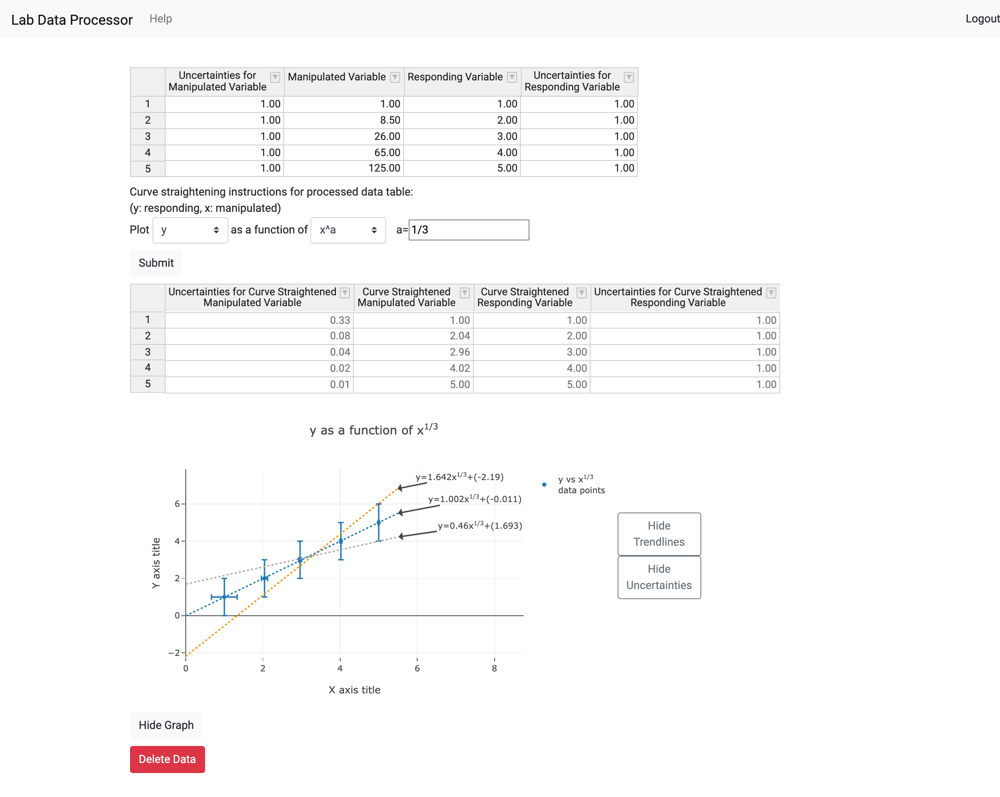

# Spreadsheet Graphs Website (Lab Data Processor)

This project is a lab data processor that can take in bivariate (x represented as a function of y) data with uncertainties, do some standard curve fitting and curve straightening on that data, and plot a graph of the processed data points.

I wanted to make a web page that is similar to Microsoft Excel and is geared towards basic analysis of data (such as for high school science labs). This project will be a work in progress for the forseeable future as I add features to it that I might find interesting--I might get to learn more about coding web pages along the way!

## About

- A deployed version of this project can be found [here](https://lab-data-processor.herokuapp.com).
- The project is divided into frontend (`spreadsheet-graphs-website`) and backend (`spreadsheet-graphs-api`) folders.
- Each of the frontend and backend folders have their own README files as well for additional details.

## Running the Project

- The frontend (`spreadsheet-graphs-website`) can be run locally by changing directories into the frontend folder (`spreadsheet-graphs-website`) and running `ng serve`.
- The backend (`spreadsheet-graphs-api`) can be run locally by starting up a local mongoDB instance with `mongod`, changing directories into the backend (`spreadsheet-graphs-api`) folder (on another terminal) and then running `nodemon`.

## Additional Info

- Additional info about using the lab data processor can be found under the [help page](https://lab-data-processor.herokuapp.com/help) of the deployed website.
- Note that the website and API are hosted on Heroku so it may take ~30 seconds for the website to load and ~30 more seconds for the first API request to come through.
- You can either make a new account to try out this project or use this test account as a login:
  - Email: `test2@test.com`
  - Password: `password`
